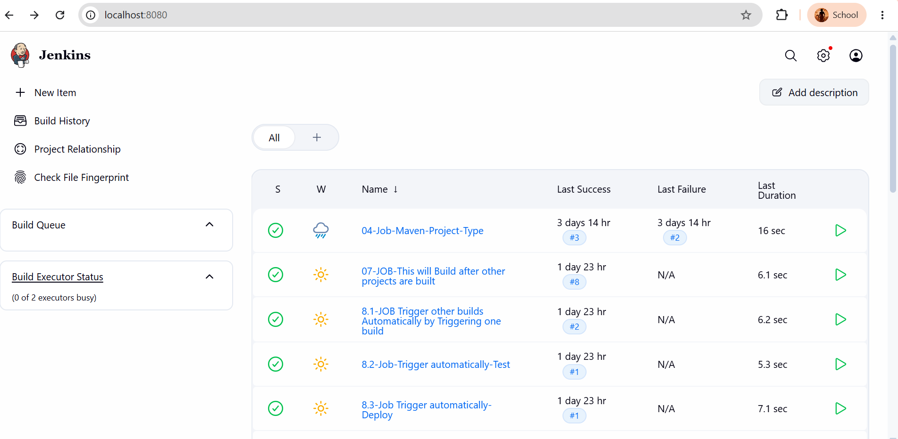

# 🖥️ Jenkins Dashboard

The Jenkins Dashboard is the main interface that appears after successfully logging into Jenkins. It serves as the central location for managing jobs, builds, plugins, users, credentials, system configuration, and monitoring the overall Jenkins environment.

---

# 📚 Table of Contents

- Introduction
- Accessing the Dashboard
- Dashboard Overview
- Header Menu
- Left Sidebar Menu
- Main Dashboard Area
- Build Queue
- Build History
- Status Indicators
- Manage Jenkins
- Dashboard Best Practices
- Summary

---

# Introduction

After installing Jenkins and creating the administrator account, you are redirected to the Jenkins Dashboard.

The Dashboard provides access to every feature available in Jenkins, allowing administrators and developers to create, manage, and monitor Continuous Integration and Continuous Delivery (CI/CD) pipelines.

It acts as the control center of Jenkins.

---

# Accessing the Dashboard

Open your browser and navigate to:

```text
http://localhost:8080
```

Enter your administrator username and password.

After successful login, the Jenkins Dashboard appears.

---

# Dashboard Overview

The Jenkins Dashboard is divided into several sections:

- Header
- Left Sidebar
- Main Workspace
- Build Queue
- Build History

Each section provides different functionality for managing Jenkins resources.

---

# Header Menu

The header appears at the top of the page.

It contains:

- Jenkins Logo
- Dashboard/Home Link
- Search Bar
- User Profile
- Logout Option
- Notifications (if configured)

The header allows quick navigation throughout Jenkins.

---

# Left Sidebar Menu

The left sidebar contains frequently used options.

Common options include:

## New Item

Used to create a new Jenkins project.

Supported project types include:

- Freestyle Project
- Pipeline
- Multibranch Pipeline
- Maven Project
- Folder

---

## People

Displays all users who have accessed Jenkins.

Administrators can view user activity and profiles.

---

## Build History

Shows recently executed builds.

Each build includes:

- Build Number
- Status
- Execution Time
- Duration

---

## Manage Jenkins

One of the most important sections in Jenkins.

Administrators use it to configure the Jenkins server.

Common options include:

- System Configuration
- Plugin Management
- Credentials
- Nodes
- Security
- Tools
- Backup
- System Information

---

## My Views

Allows users to organize projects into custom views.

Useful when managing a large number of Jenkins jobs.

---

# Main Dashboard Area

The center section displays all Jenkins projects.

For every project, Jenkins displays:

- Project Name
- Build Status
- Last Successful Build
- Last Failed Build
- Last Build Time

Initially, this area is empty because no jobs have been created.

Once projects are created, they appear here automatically.

---

# Build Queue

The Build Queue displays jobs waiting to execute.

A job enters the queue when:

- Multiple builds are running
- No executor is available
- Another build is already executing

After an executor becomes available, Jenkins starts the queued build automatically.

---

# Build History

The Build History section displays all completed builds.

For each build, Jenkins records:

- Build Number
- Build Result
- Build Duration
- Build Time
- Console Output
- Build Logs

This helps developers troubleshoot failed builds.

---

# Build Status Indicators

Jenkins uses colored icons to indicate build status.

| Icon | Meaning |
|------|---------|
| 🟢 Blue/Green | Build Successful |
| 🔴 Red | Build Failed |
| 🟡 Yellow | Build Unstable |
| ⚪ Gray | Build Not Executed |
| 🔵 Animated | Build Running |

Monitoring these indicators helps identify problems quickly.

---

# Manage Jenkins

The **Manage Jenkins** page contains administrative settings.

Important options include:

## System Configuration

Configure:

- Jenkins URL
- Email Notifications
- Environment Variables
- Global Settings

---

## Plugins

Install, update, remove, or disable plugins.

Plugins extend Jenkins functionality.

Examples:

- Git Plugin
- Docker Plugin
- Maven Integration
- Pipeline Plugin
- Blue Ocean

---

## Credentials

Store sensitive information securely.

Examples:

- GitHub Personal Access Tokens
- SSH Keys
- AWS Access Keys
- Docker Hub Credentials
- Username and Password

Credentials are encrypted and reused across multiple jobs.

---

## Global Tool Configuration

Configure development tools used by Jenkins.

Common tools include:

- Git
- Maven
- Gradle
- JDK
- Docker

Once configured, Jenkins automatically uses these tools while executing builds.

---

## Nodes

Nodes are machines that execute Jenkins jobs.

Types of nodes:

- Controller (Master)
- Agent (Worker)

Using multiple agents improves scalability and reduces build time.

---

## Security

Configure authentication and authorization.

Supported methods include:

- Jenkins User Database
- LDAP
- Active Directory
- GitHub Authentication
- Role-Based Authorization

---

## System Information

Displays detailed information about the Jenkins server.

Includes:

- Java Version
- Operating System
- Installed Plugins
- Memory Usage
- Environment Variables

Useful for troubleshooting.

---

# Dashboard Best Practices

- Keep Jenkins updated.
- Remove unused jobs.
- Install only required plugins.
- Organize projects using folders.
- Regularly monitor build history.
- Secure administrator accounts.
- Backup Jenkins configuration frequently.

<p align="center">
  
</p>

---

